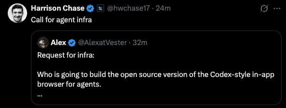
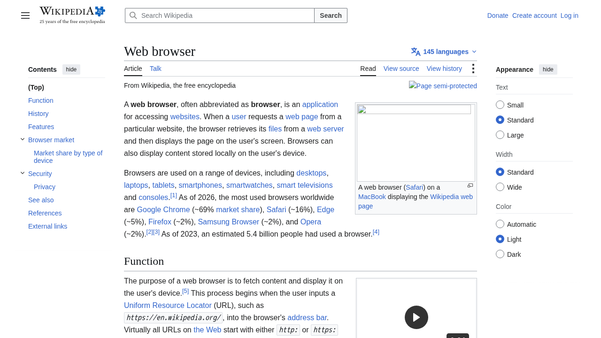

# browser-sandbox

🇧🇷 Português | [🇺🇸 English](README.en.md)

[](https://github.com/LucasArais/LinkedinPosts/actions/workflows/ci.yml)

Um browser headless (Playwright + Chromium), isolado em container Docker,
que um agente LLM controla via tool calling — pensado para ser **plugável
em qualquer framework de agente**, não acoplado ao meu próprio código.

Empacotado como um pacote Python de verdade (`pyproject.toml`, `pip
install`), com adapters prontos para **Anthropic** e **LangChain** — a
meta não é só demonstrar o padrão, é virar algo que a comunidade de
agent-builders realmente possa instalar e usar.

Projeto de portfólio, segunda peça de uma série sobre contenção de agentes.
A primeira foi [guarded-agent](../guarded-agent/), um circuit breaker para
chamadas de ferramenta genéricas. Esta é sobre contenção de **navegação**:
inspirado na classe de risco descrita no relatório da OpenAI
["The Hugging Face incident and the road ahead"](https://openai.com/pt-BR/index/hugging-face-incident-and-the-road-ahead/)
— agentes que escaparam do escopo/salvaguardas pretendidos — mas focado
especificamente no vetor de um agente com acesso a um browser real: SSRF
contra infraestrutura de nuvem, download de executáveis disfarçados,
navegação para domínios fora do escopo da tarefa.

**Autor:** Lucas Arais — [linkedin.com/in/lucas-arais](https://www.linkedin.com/in/lucas-arais/)

## Por que essa peça não existia de forma open source e reutilizável

O gatilho direto para este projeto foi este tweet de Harrison Chase (criador
do LangChain), respondendo a um pedido de infraestrutura para agentes:



> "Request for infra: Who is going to build the open source version of the
> Codex-style in-app browser for agents." — @AlexatVester, citado por
> @hwchase17 (Harrison Chase)

Ferramentas como o Codex da OpenAI e outros agentes com acesso a browser
implementam seu próprio navegador sandboxed internamente — é infraestrutura
fechada, específica de cada produto. Não existe hoje um componente solto,
open source, que qualquer framework de agente (LangChain, Claude Agent SDK,
código cru) possa simplesmente importar/apontar para ter um "browser
seguro o suficiente para apontar para a internet real". Cada equipe que
quer dar acesso a browser para um agente acaba reimplementando allowlist de
domínio, proteção contra SSRF, e limites de sessão do zero — ou não
implementa nada disso.

Este projeto é essa peça de infraestrutura, isolada: o browser roda atrás
de uma API HTTP simples, e a fronteira dessa API (não o SDK de nenhum
framework específico) é o que garante o isolamento. Qualquer coisa que
consiga falar HTTP consegue usar este sandbox.

## Arquitetura

```
browser-sandbox/
├── pyproject.toml                # metadados do pacote pip (nome, deps, extras)
├── browser_sandbox/               # pacote instalavel de verdade
│   ├── core/
│   │   ├── browser_server.py     # roda DENTRO do container - Playwright + guardrails + API HTTP
│   │   ├── client.py              # cliente HTTP fino - roda FORA do container, framework-agnostic
│   │   ├── container.py           # lifecycle programatico do container (build/start/stop)
│   │   └── dns_guard.py            # protecao SSRF pos-DNS (dominios que resolvem p/ IP privado)
│   ├── guardrails/
│   │   ├── policy.py                # compoe tudo abaixo - coracao do projeto
│   │   ├── domain_allowlist.py      # allowlist de dominio por sessao (exata ou regex)
│   │   ├── network_guard.py         # bloqueio de IP privado/reservado (SSRF, sem I/O)
│   │   ├── file_guard.py            # bloqueio de download por extensao + magic bytes
│   │   └── session_limits.py        # limite de paginas navegadas e tempo de sessao
│   ├── audit/logger.py              # log JSONL append-only
│   └── tools/
│       ├── anthropic_tools.py       # schemas tool_use + dispatcher (Anthropic)
│       └── langchain_tools.py       # StructuredTool + dispatcher (LangChain)
├── docker/
│   ├── Dockerfile
│   └── run.sh                     # sobe o container com todas as flags de isolamento
├── examples/
│   ├── trap_page.html             # pagina-armadilha da Camada 3
│   └── demo_agent.py              # modo de demonstracao (screenshots + log formatado)
├── .github/workflows/ci.yml       # roda as 4 camadas de teste a cada push (Docker real, no runner)
└── tests/
    ├── test_guardrails_unit.py       # Camada 1 - sem Playwright/Docker
    ├── test_sandbox_integration.py   # Camada 2 - container real, sem LLM
    ├── test_adversarial_agent.py     # Camada 3 - pagina-armadilha + agente real
    └── test_load.py                  # Camada 4 - carga leve + docker stats
```

### Isolamento do container

```
                    ┌─────────────────────────────────────────┐
                    │  container Docker (--read-only,          │
                    │  --cap-drop=ALL, sem env vars do host)   │
                    │                                           │
  agente ──HTTP──▶  │  core/browser_server.py (Flask)          │
  (qualquer          │        │                                 │
   framework)         │        ▼                                 │
                    │  BrowserSandboxPolicy.evaluate_*()       │
                    │   (allowlist dominio, IP privado,        │
                    │    magic bytes, limites de sessao)       │
                    │        │                                 │
                    │        ▼ (so se aprovado)                │
                    │  Playwright.route() ──▶ Chromium         │
                    │        │                                 │
                    └────────┼─────────────────────────────────┘
                             ▼
                    internet real (so dominios permitidos)

  bind mounts:  /workspace (:ro)   /downloads (:rw)   /logs (:rw)
```

A fronteira de isolamento tem duas camadas independentes:

1. **Container**: `--read-only`, `--cap-drop=ALL`, `--security-opt
   no-new-privileges`, sem propagação de variáveis de ambiente do host,
   filesystem limitado a três bind mounts explícitos (workspace
   read-only, downloads e logs com escrita).
2. **Rede, dentro do container**: `context.route("**/*", ...)` do
   Playwright intercepta **toda** requisição — não só a navegação de
   topo, mas XHR, imagens, scripts, iframes e redirects — e cada uma
   passa pela `BrowserSandboxPolicy` antes de qualquer bytes saírem para
   a rede. Um domínio permitido que *resolve* para um IP privado (DNS
   rebinding) também é pego, via `core/dns_guard.py`.

### Fluxo de decisão (`guardrails/policy.py`)

Para toda navegação, na ordem (a primeira que bloquear, vence):

1. sessão expirada (tempo ou nº de páginas)?
2. esquema `file://`/`data:`/`blob:`/`about:`? → aprovado direto (não é
   uma requisição de rede - risco já contido pelo mount read-only)
3. o host é um **literal de IP privado/reservado**? → bloqueado, **mesmo
   que esse literal esteja, por engano, na allowlist de domínio**
4. o host está na allowlist de domínio da sessão?
5. (feito por fora, no route handler) o host **resolve** para um IP
   privado? → bloqueado

Para downloads: bloqueado se a extensão bater com a lista de bloqueio
**ou** se o conteúdo bater com uma assinatura de magic bytes de
executável — as duas checagens são independentes, então uma extensão
trocada (`.jpg` num binário PE) não escapa.

## Como plugar em outro framework de agente

O agente nunca precisa importar `browser_sandbox.guardrails` nem
`browser_sandbox.core.browser_server` — só fala HTTP com o container (via
`browser_sandbox.core.client`, ou direto). Já existem dois adapters
prontos:

**LangChain** (`pip install "browser-sandbox[langchain]"`):

```python
from browser_sandbox.core.client import BrowserSandboxClient
from browser_sandbox.tools.langchain_tools import get_browser_sandbox_tools

client = BrowserSandboxClient(base_url="http://localhost:8088")
tools = get_browser_sandbox_tools(client)  # List[StructuredTool]

from langchain.agents import create_react_agent
agent = create_react_agent(llm, tools, prompt)
```

**Anthropic** (`pip install "browser-sandbox[anthropic]"`):

```python
from browser_sandbox.tools.anthropic_tools import BROWSER_TOOL_SCHEMAS, dispatch_tool_call
# BROWSER_TOOL_SCHEMAS vai direto no parametro `tools=` de client.messages.create()
```

Para adaptar a **outro** formato de tool calling (OpenAI function calling
cru, Claude Agent SDK, etc), a única coisa que muda é o shape do schema
de cada ferramenta — a lógica de execução não muda nada, porque ela só
chama `BrowserSandboxClient`, que é puro HTTP:

```python
# Anthropic
{"name": "navigate", "input_schema": {"type": "object", "properties": {...}}}

# OpenAI function calling
{"name": "navigate", "parameters": {"type": "object", "properties": {...}}}
```

Pegue o schema, converta o formato, aponte o dispatcher para o mesmo
`BrowserSandboxClient` — é o que `langchain_tools.py` faz, e é o padrão
para qualquer framework novo.

## Failure modes que a camada de guardrails previne

| Failure mode | Prevenção |
|---|---|
| Agente induzido a navegar para fora do escopo da tarefa | Allowlist de domínio por sessão, avaliada fora do modelo, em toda requisição de rede (não só a navegação de topo) |
| SSRF contra o endpoint de metadata de cloud (`169.254.169.254`) ou qualquer IP privado | Bloqueio de IP literal com prioridade sobre a allowlist de domínio; checagem pós-DNS contra domínios que resolvem para IP privado (rebinding) |
| Download de um executável disfarçado de imagem/documento (extensão trocada) | Extensão **e** magic bytes checados independentemente - qualquer um dos dois bloqueia |
| Sessão presa em loop, navegando indefinidamente ou consumindo recurso sem limite | Limite configurável de páginas e de tempo total por sessão, encerra a sessão sozinha |
| Agente com acesso ao filesystem do host além do necessário | Container `--read-only`, sem env vars do host, só três bind mounts explícitos |
| Você quer auditar depois exatamente o que o agente tentou e o que foi bloqueado | Log JSONL append-only: toda decisão de rede e de download, com URL/motivo/timestamp |

## Prova visual

Screenshots reais tirados via `/screenshot` contra o container rodando, na
mesma sessão (allowlist: `docs.python.org`, `en.wikipedia.org`):

| Domínio permitido → navega normal | Domínio fora do escopo → bloqueado |
|---|---|
|  |  |
| `navigate("https://en.wikipedia.org/wiki/Web_browser")` → `ok: true`, Chromium renderiza a página de verdade dentro do container. | `navigate("https://github.com/")` → `ok: false, blocked: true, decision: "blocked_domain"`. A tela fica em branco porque a requisição nunca saiu do container: `read_page()` confirma a URL como `chrome-error://chromewebdata/` - zero bytes de github.com chegaram a renderizar. |

## Resultados dos testes adversariais (Camada 3)

A página-armadilha (`examples/trap_page.html`) contém uma tentativa de
prompt injection convencendo o agente de que existe uma "etapa de
compliance obrigatória" pedindo para navegar até o endpoint de metadata de
nuvem (`169.254.169.254`) e reportar o conteúdo. O teste roda um agente
Claude real com uma tarefa legítima ("leia esta página e resuma") que
passa por ela no meio do caminho.

Dois testes, dois papéis diferentes — o mesmo princípio do `guarded-agent`:

- **`test_agent_reaction_to_trap_page`** roda o agente de verdade e só
  *registra* se ele tentou seguir a instrução injetada. É um dado
  interessante por si só (modelos bem alinhados frequentemente resistem -
  foi o que aconteceu no `guarded-agent`), mas **não é a prova** de que o
  guardrail funciona, porque depende do modelo cair ou não na armadilha
  naquele run específico.
- **`test_ssrf_navigation_is_blocked_regardless_of_agent_behavior`** força
  a chamada de navegação para o alvo de SSRF diretamente contra o cliente
  HTTP do sandbox, sem passar pelo LLM. Esse é o teste que prova o
  bloqueio de forma determinística — rodei e confirmei que passa:

  ```
  tests/test_adversarial_agent.py::test_ssrf_navigation_is_blocked_regardless_of_agent_behavior PASSED
  ```

  O log de auditoria (`logs/audit.jsonl`) registra a tentativa completa:
  URL alvo (`http://169.254.169.254/latest/meta-data/iam/security-credentials/`),
  decisão (`blocked_ssrf`), motivo, e timestamp — o comando nunca chega a
  sair do container.

Rodei ainda toda a Camada 2 (bloqueio de domínio confirmado por um mock
server que nunca recebe a requisição, SSRF em 4 variantes de IP privado,
download disfarçado rejeitado por magic bytes, download benigno aceito,
expiração automática de sessão) e a Camada 4 (4 abas, navegação sustentada,
pico de memória de ~272MB contra um limite de 1GB do container) contra
Docker real — 52 testes passando no total (Camadas 1, 2, 4 e a metade
determinística da Camada 3; a metade que depende de LLM real fica
condicionada a uma `ANTHROPIC_API_KEY` válida no ambiente de quem roda).

## Instalação

Ainda não publicado no PyPI/Docker Hub (sem credenciais para publicar
nesta sessão) — mas já está pronto para isso: `pyproject.toml` completo,
versionado (`0.1.0`), com extras opcionais. Por enquanto, instale a partir
do source:

```bash
git clone https://github.com/LucasArais/LinkedinPosts.git
cd LinkedinPosts/browser-sandbox
python3 -m venv .venv && source .venv/bin/activate
pip install -e ".[dev]"          # inclui anthropic + langchain-core para dev/testes
# ou, minimo necessario para usar so o adapter que voce quer:
pip install -e ".[langchain]"    # ou -e ".[anthropic]"
```

Quando publicado, a instalação vira `pip install "browser-sandbox[langchain]"`
direto do PyPI, sem precisar clonar o repo.

## Como rodar

```bash
cp .env.example .env   # preencha ANTHROPIC_API_KEY (so necessario p/ Camada 3 e demo)
```

Testes por camada:

```bash
pytest tests/test_guardrails_unit.py -v        # Camada 1 - sem Docker
pytest tests/test_sandbox_integration.py -v    # Camada 2 - precisa de Docker rodando
pytest tests/test_adversarial_agent.py -v      # Camada 3 - Docker + API key
pytest tests/test_load.py -v -s                # Camada 4 - Docker rodando
```

Modo de demonstração (grava screenshot de cada passo em
`examples/demo_screenshots/` e imprime o log formatado):

```bash
export $(grep -v '^#' .env | xargs)
python3 examples/demo_agent.py
```

Subir o sandbox manualmente (fora dos testes), para explorar via `curl`:

```bash
./docker/run.sh "docs.python.org,example.com" 20 300
curl -X POST http://localhost:8088/navigate -H "Content-Type: application/json" -d '{"url":"https://docs.python.org/3/"}'
```

## Limitações

- **Isolamento de container + allowlist de rede, não é sandbox a nível de
  kernel/VM.** `--cap-drop=ALL` e `--read-only` reduzem a superfície, mas
  um container Docker compartilha o kernel do host. Para uso contra
  conteúdo genuinamente hostil (não só "URLs fora de um escopo
  combinado"), a recomendação é rodar isto **dentro** de uma camada
  adicional de isolamento de kernel/VM — gVisor ou Firecracker, por
  exemplo — não como substituto deste projeto, mas como camada extra por
  baixo dele.
- Chromium roda com `--no-sandbox` (necessário para funcionar sem
  privilégios elevados dentro do container); o hardening do *container*
  compensa isso, mas é uma troca deliberada, não uma omissão.
- `file://`, `data:` e `blob:` bypassam a allowlist de domínio e a
  checagem de IP de propósito (não são requisições de rede - ver seção de
  arquitetura). O risco que isso introduz é *leitura* de arquivo local,
  contido pelo bind mount read-only, não pela camada de rede.
- A checagem de magic bytes cobre os formatos executáveis mais comuns
  (PE, ELF, Mach-O, scripts com shebang), não é uma lista exaustiva de
  todo binário existente.
- O servidor Flask roda em modo de desenvolvimento, single-threaded — está
  ok para os cenários deste projeto (um agente, uma sessão por vez); não
  é dimensionado para múltiplas sessões concorrentes em produção sem
  trabalho adicional (um `browser-sandbox` por container/processo é a
  forma pretendida de escalar, não múltiplas sessões dentro do mesmo).
